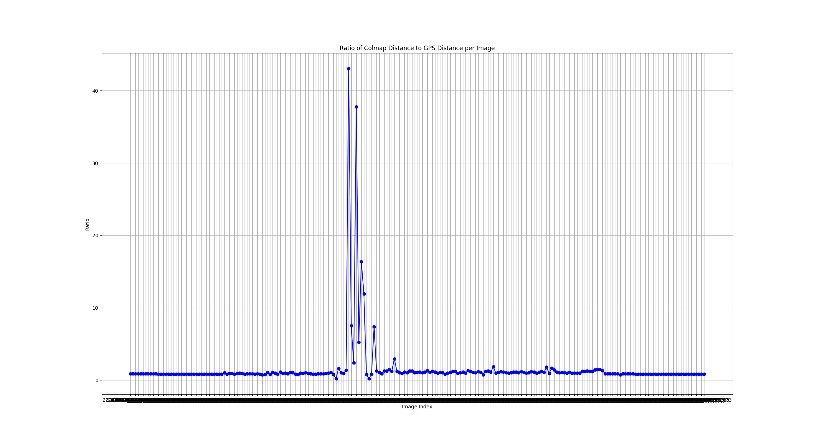

# [IEEE - IROS24] Temporal-and Viewpoint-Invariant Registration for Under-Canopy Footage using Deep-Learning-based Bird's-Eye View Prediction

## Description
This project proposes a new approach for registering multiple under-canopy image sequences by leveraging standard GPS data, sparse Structure from Motion, and deep-learning-based perspective-view to bird-eye view conversion. 

**An overview of the pipeline** is shown below.


🔗 **[Click here to view the poster](docs/2024iros_poster_jiawei.pdf)**

If you use our code in an academic work, please cite:

      @Inproceedings{zhou2024temporal,
        title={Temporal-and Viewpoint-Invariant Registration for Under-Canopy Footage using Deep-Learning-based Bird's-Eye View Prediction},
        author={Zhou, Jiawei and Mascaro, Ruben and Cadena, Cesar and Chli, Margarita and Teixeira, Lucas},
        booktitle={2024 IEEE/RSJ International Conference on Intelligent Robots and Systems (IROS)},
        year={2024}
      }

## Installation

The code has been tested only on Linux. Follow these steps to set up the project environment:

1. Clone the Repository
   - Clone this repository to your local machine

2. Create and Activate a Virtual Environment
   - Use Conda to create a new environment and activate it:
     ```bash
     conda create -n myenv python=3.10.12
     conda activate myenv
     ```

3. Install Required Dependencies
   - Install all necessary Python packages using pip within the newly created environment (this process may take a while):
     ```bash
     pip install -r requirements.txt
     ```

4. Install COLMAP
   - For detailed instructions on installing COLMAP, refer to the official installation guide:
     [COLMAP Installation Guide](https://colmap.github.io/install.html)


## Preparation
- **Data Preparation**
   
   We need to prepare a project folder to store all outputs, images folders to store iamges sequence, images lists, BEV folders to save BEV images and GT_params for evaluation. The structure is recommended to look as follows:
   ```yaml
   case_name:
   ├──Data_name:	
   │    ├──base_model:
   │    |   ├──BEV
   │    |   ├──images
   │    │   ├──image_list.txt
   │    │   └──GT_params
   │    └──query_models:
   │        └──...
   │
   ├──Project_name 
   │    ├──Models: 
   │    |   ├──Model_0 (reference model)
   │    |   |   ├──sparse (point cloud, if provided)
   │    |   |   └──...
   │    |   ├──Model_1 (query model)
   │    |   |   ├──sparse (point cloud, if provided)
   │    |   |   └──...
   │    │   └──...
   │    └──Images_LV95_batches.csv        
   ```

- **Demo**

   ⭐ **Our pipeline has been tested on 3 datasets:**

    1. **Different Seasons** (base: winter; query: summer):  
       Script: `command_diffseasons.py` (Config: `config_diffseasons.json`)
       
    2. **Perpendicular Viewpoints** (base: winter; query: summer_east, summer_north):  
       Script: `command_perpendicular_views.py` (Config: `config_perpendicular_views.json`)
       
    3. **Andreas Park Zigzag** (base: 0130; query: submodels of 0127):  
       Script: `command_andreas.py` (Config: `config_andreas.json`)

    You can find the datasets here:  
    - [Datasets for cases 1 and 2](https://drive.google.com/drive/folders/1cVXYFaNytEoAP8SAZe_uD04fEkttMI32)  
    - [Dataset for case 3](https://drive.google.com/drive/folders/1aaSXf4AurDg1T4Vv0EX6qFYNV47cU4OZ?usp=drive_link)

    **Instructions**

    Please download the datasets and organize them according to the format above. Run the demo scripts `command_diffseasons.py`, `command_diffviews.py`, and `command_andreas.py` for cases 1-3 (Replace file and folder paths with actual paths).
   
    The parameters for each demo are selected based on the characteristic of different models, e.g. boundary of working area, sparsity, accuracy of bev (gt or prediction), density of trees etc. For more details, please refer to the notice section below.

   ⭐ The overall structure is demonstrated in `pipeline_demo.py`.

- **Expected output** 
  
   You can expect outputs with the following structure:
   ```yaml
   ├──project_name:
   │    ├──Models:
   │    |   ├──Model_0 (base model)
   │    |   └──... (query models)
   │    ├──Correctness_loop: 
   │    |   ├──initial_alignment (step 6-initial ICP)
   │    |   ├──1_ICP_models (step 7-vertical correctness)
   │    |   ├──2_horizontal (step 7-horizontal correctness)
   │    |   ├──3_batch_align (step 8-batch alignment)
   │    |   └──evaluation 
   │    └─Images_LV95_batches.csv
   ```


## Step 1: Images Data Collection
- `collect_transform_image_data.py`
- Read the corresponding camera poses for the images in the images_list. 
- Transform coordinates to LV95, apply shift by constance. 
- Bound the working area. 
- Cluster the images based on camera positions if needed. 
- This step will generate a file named 'Images_LV95_batches.csv'.

## Step 2: Colmap Reconstruction
- This process may take several hours. Skip this step if the point cloud is already provided.
- `colmap_cli_pipeline.py`
- This step will generate a sparse point cloud (`Models/Model_idx/sparse` with `database.db`) for each model.

## Step 3: GPS alignment
- `transform_shifted_LV95.py`
- Transform the reconstructed sparse point cloud to shifted LV95 coordinate system using colmap model aligner (work with colmap 3.8).
- Then generate the .txt files for visualization. (You can find `plot.txt` and `cam_extracted_m0.txt` in the `shifted_LV95_model_txt` folder, and visualize them in CloudCompare to view the point cloud and camera poses.)

## 🔍 Checking Step: camera sequence scale checking
- `camera_sequence_cut.py`
- Detect the reconstruction failure by calculating the relative distance between consecutive camera poses in the GPS-aligned 3D reconstruction and compare it to the relative distance between their corresponding GPS positions.
- If a scale difference higher than threshold found, as shown in:  we split the original image sequence into multiple subsequences, each maintaining a consistent scale. Then we need to rerun the Step1-3 again given the new image sequences (image lists).

## Step 4: Tree Position Extraction from BEV, Tree Area Segmentation, and Ground Extraction
1. `tree_positions.py`
   - Detect the blobs from BEV and convert the detected centers into 3d coordinate. The final extracted tree positions `tree_positions.txt` can be found in the file `tree_positions.txt`, located in the folder `tree_positions_shifted_LV95`.
2. `tree_area_segmentation.py`
   - Segment an area around each tree position from BEV. All segments can be found in the folder `Tree_Segmentation`.
3. `Gr_Ex_heightslice.py`
   - Pre-processing; slicing and gaussian fitting; post-processing.

## Step 5: Evaluation Preparation
<!-- 1. `eval_gt_cam.py`
   - Preparing the gt camera poses for each model given image lists. -->
`estimation_LV95_gt_trans.py`
   - Preparing the gt camera poses for each model given image lists. (# offset recommended: apple farm [2678199.0, 1258409.0, 445.000]; andreas [2684399.0 1251969.0 200.0])
   - Transform initial models (LV95) to the GT coordinate (will be used to evaluate reconstruction error), save the transformation matrix for the base model, and then transform all query models using the saved transformation matrix of the base model (so that the models could be directly compared with GT after alignment) for evaluation later. 
   - In the following steps, align `GTAlign_Init_Model_1`, `GTAlign_Init_Model_2`, ..., to `GT_Model_0`.

## Step 6: Initial Alignment (ground of Query Models wrt. ground of Base Model)
1. `initial_alignment.py`
   - Apply a z-shift and perform ICP between ground extracted.
2. `tree_seg_after_swisstopo.py`, `Gr_Ex_after_swisstopo.py`
   - Rerun tree segmentation and ground extraction after the initial alignment to extract cleaner ground and more accurate trunks. We utilize the trunk centers extracted from step 4 as initial tree position here. 

## Step 7: Loop Alignment
Loop between vertical correctness (7.1) and horizontal correctness (7.2). Calculate an overall transformation matrix.
1. `Loop_vertical_ICP.py`
   - Perform point-to-plane ICP between grounds, transform the ground and tree centers accordingly; the middle results are saved.
2. `horizontal_correctness_models.py`
   - (From experiment: scaling only works when the tree centers are relatively accurate.)
   - Find tree pairs and perform correspondence alignment, transform the ground and tree centers accordingly and save the middle results.

## Step 8: Batch Alignment
1. `batch_preparation.py`
   - Calculate the tree centers error for all tree pairs and construct a Delaunay Triangulation.
   - Assess the error similarity across all edge pairs within this network, and then cut the edges with low similarity value, grouping tree centers with high error similarity together.
   - Compute the centroid of each cluster to serve as an initial seed for the k-means clustering algorithm. 
2. `batch_alignment.py`
   - Align each batch separately based on its tree centers.
3. `batch_cam_assign.py`
   - Assign cameras to each batch based on their positions and orientations.

## Step 9: Evaluation: Camera Poses and Tree Centers
1. `cam_error_evaluation.py`
   - camera poses extracted from colmap models wrt. gt camera poses.
2. `trees_eval.py`
   - tree centers extracted from query models wrt. those from base model.


## **Comparison**
Preparation: open the point clouds in cloudcompare, segment the points in working area and save them as .asc, .ply (ASCII) format.
1. ICP: `methodcompare_ICP.py`. For the input: we can either use the segmented .asc file, or the original file with defined boundary. We can add an initial transformation here to assist ICP alignment (e.g. trans_init[2,3]=-100 for cross_seasons case)
2. FGR: `methodcompare_FGR.py`. For the input: same as ICP based method. The parameter could be adjusted for different cases.
3. Fast and Robust ICP: [Installation and implementation](https://github.com/yaoyx689/Fast-Robust-ICP). We use 2 & 3 here for comparison. in /build folder, run `./FRICP ./data/target.ply ./data/source.ply ./data/output/ 3` in terminal to get the transformation matrix. Then transform the models with `methodcompare_others.py`
4. Teaser++: [Installation and Implement](https://teaser.readthedocs.io/en/latest/installation.html), revise the [example python_fpfh code](https://github.com/MIT-SPARK/TEASER-plusplus/tree/master/examples/teaser_python_fpfh_icp) to `teaser_fpfh_forest.py` to run the alignment. Then transform the models with `methodcompare_others.py`
   
[For tree centers: `trees_eval_compare.py` can help to transform the colmap initial tree centers given calculated transformation matrix by each method]


## **Notice:** 
Please carefully review the intermediate results to ensure everything functions correctly for your own dataset, especially the extracted features and alignment results. 

⚙️ The explanations and definitions of important parameters can be found in `config.yaml`. You can set up your own configuration file and read it using the following code:
```bash
import yaml

def load_config():
    with open('config.yaml', 'r') as config_file:
        config = yaml.safe_load(config_file)
        return config
```

## Future work:
1. Feature extraction process rely on the parameters
2. Tree centers extraction refinement
3. Reoptimization after Batch alignment
